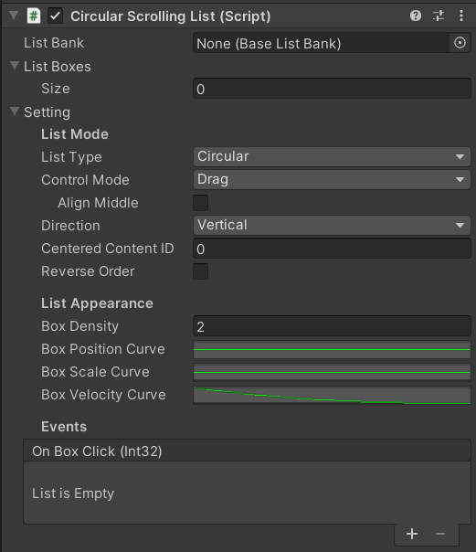

# Circular Scrolling List


## Features

* Use finite list boxes to display infinite list items
* 2 list types: Circular or Linear mode
* 3 Control modes: Drag, Function, or Mouse wheel
* Support both vertical and horizontal scrolling
* Custom layout and movement
* Custom displaying contents
* Support all three render modes of the canvas plane
* Support Unity 5+ (Tested in Unity 5.6.7f1)

[Demo video](https://youtu.be/k63eqwfj-1c)

## Properties



|Property|Description|
|:--------|:--------|
|**List Bank**|The game object that stores the contents for the list to display|
|**List Boxes**|The game objects that used for displaying the content|
|**Setting**|The setting of the list|
|[List Mode]||
|-- **List Type**|The type of the list. Could be **Circular** or **Linear**|
|-- **Control Mode**|The controlling mode. Could be **Drag**, **Function**, or **Mouse Wheel**<br>See [Set the Control Mode](#set-the-control-mode) for more information|
|---- **Align Middle**|Whether to align a box in the middle after sliding or not.<br>Available if the control mode is **Drag**.|
|---- **Reverse Direction**|Whether to reverse the scrolling direction or not.<br>Available if the control mode is **Mouse Wheel**.|
|-- **Direction**|The major scrolling direction. Could be **Vertical** or **Horizontal**|
|-- **Centered**<br>**Content ID**|The initial content ID to be displayed in the centered box|
|-- **Reverse Order**|Whether to reverse the content displaying order or not|
|[List Appearance]||
|-- **Box Density**|The factor for adjusting the distance between boxes.<br>The larger, the closer|
|-- **Box Position Curve**|The curve specifying the passive position of the box<br>See [Appearance Curves](#appearance-curves) for more information|
|-- **Box Scale Curve**|The curve specifying the box scale|
|-- **Box Velocity Curve**|The curve specifying the velocity factor of the box after releasing.<br>Available if the control mode is **Drag**.|
|-- **Box Movement Curve**|The curve specifying the movement factor of the box.<br>Available if the control mode is **Function** or **Mouse Wheel**.|
|[List Event]||
|-- **On Box Click**|The callback to be invoked when a box is clicked.<br>The int parameter is the content ID of the clicked box.|

## How to Use

### Set up the List

1. Add a Canvas plane to the scene. Set the render mode to "Screen Space - Camera" for example, and assign the "Main Camera" to the "Render Camera". \
    
2. Create an empty gameobject as the child of the canvas plane, rename it to "CircularScrollingList" (or another name you like), and attach the script `ListPositionCtrl.cs` to it. \
    
3. Create a Button gameobject as the child of the "CircularList", rename it to "ListBox", change the sprite and the font size if needed. \
    
4. Create a new script `IntListBox.cs` and add the following code. For more information, see [ListBank and ListBox](#listbank-and-listbox) section.

    ```csharp
    using AirFishLab.ScrollingList;
    using UnityEngine;
    using UnityEngine.UI;

    // The box used for displaying the content
    // Must be inherited from the class ListBox
    public class IntListBox : ListBox
    {
        [SerializeField]
        private Text _contentText;

        // This function is invoked by the `CircularScrollingList` for updating the list content.
        // The type of the content will be converted to `object` in the `IntListBank` (Defined later)
        // So it should be converted back to its own type for being used.
        // The original type of the content is `int`.
        protected override void UpdateDisplayContent(object content)
        {
            _contentText.text = ((int) content).ToString();
        }
    }
    ```

5. Attach the script `IntListBox.cs` to it, assign the gameobject "Text" of the Button to the "Content Text" of the `ListBox.cs`, and then create a prefab of it .\
    
6. Duplicate the gameobject `ListBox` or create gameobjects from the prefab as many times as you want (4 times here, for exmaple)
7. Click the menu of the `CircularScrollingList` and select "Assign References of Bank and Boxes" to automatically add the reference of boxes to it (The list boxes must be the children of `CircularScrollingList`), or maually assign them to the property "List Boxes". \
    
    
8. Create a new script `IntListBank.cs` and add the following code. For more information, see [ListBank and ListBox](#listbank-and-listbox) section.

    ```csharp
    using AirFishLab.ScrollingList;

    // The bank for providing the content for the box to display
    // Must be inherit from the class BaseListBank
    public class IntListBank : BaseListBank
    {
        private readonly int[] _contents = {
            1, 2, 3, 4, 5, 6, 7, 8, 9, 10
        };

        // This function will be invoked by the `CircularScrollingList`
        // when acquiring the content to display
        // The object returned will be converted to the type `object`
        // which will be converted back to its own type in `IntListBox.UpdateDisplayContent()`
        public override object GetListContent(int index)
        {
            return _contents[index];
        }

        public override int GetListLength()
        {
            return _contents.Length;
        }
    }
    ```

9. Attach the script `IntListBank.cs` to the gameobject "CircularScrollingList" (or another gameobejct you like)
10. Again click the menu of the `CircularScrollingList` and select "Assign References of Bank and Boxes" to automatically add the reference of `IntListBank` to it (The script must be in the same gameobject of the `CircularScrollingList`), or manually assign it to the property "List Bank". \
    
11. Adjust the height or width of the rect transform of the gameobject "CircularScrollingList". When running, the list boxes will be evenly distributed in the range of height (for **Vertically** scrolling list) or width (fot **Horizontally** scrolling list). \
    
12. Click "Play" to see the result

### Set the Control Mode

There are 3 control mode for the list:

* **Drag**: The list can be moved by dragging it.
* **Function**: The list can be moved by invoking `CircularScrollingList.MoveOneUnitUp()` or `CicularScrollingList.MoveOneUnitDown()`. \
  For the **horizontally** scolling list, invoking `CircularScrollingList.MoveOneUnitUp()` will move the list one unit right, and one unit left by invoking `CicularScrollingList.MoveOneUnitDown()`. \
  In this mode, the list can be moved by additional buttons by assigning these two function to them. \
  
* **Mouse Wheel**: The list can be moved by scrolling the mouse wheel.

### Appearance Curves

* **Box Position Curve**: The curve specifying the passive position of the box
  * X axis: The major position of the box, which is mapped to [0, 1] (from the smallest value to the largest value).
  * Y axis: The factor of the passive position. One unit equals to an half of moving range.

  For example, in the vertical mode, the major position is the y position and the passive position is the x position: \
   \
  It is intuitive in the horizontal mode: \
  
* **Box Scale Curve**: The curve specifying the box scale
  * X axis: Same as the box position curve
  * Y axis: The scale value of the box at that major position
* **Box Velocity Curve**: The curve specifying the velocity factor of the box after releasing
  * X axis: The movement duration in seconds, which starts from 0.
  * Y axis: The factor relative to the releasing velocity

  The y value of curve should **start from 1 and end with 0**. \
  
* **Box Movement Curve**: The curve specifying the movement factor of the box. 
  * X axis: Same as the box velocity curve
  * Y axis: The factor relative to the target position.

  The y value of curve should **start from 0 and end with 1**. \
  

#### Curve Presets

The project provides curve presets. Open the curve editing panel and select the `BoxCurvePresets` to use them. \
 \
 \
Part A are position curves, part B are scale curves, part C is a velocity curve, and part D is a movement curve.

## `ListBank` and `ListBox`

Scene version 5, the list supports custom content type. Different type of `ListBank` and `ListBox` can be used in the different list. In this section mentions how to implement your own `ListBank` and `ListBox`.


### Custom `ListBank`

Here is the example of the custom `ColorStrListBank`:

```csharp
public class ColorStrListBank : BaseListBank
{
    [SerializeField]
    private ColorString[] _contents;

    public override object GetListContent(int index)
    {
        return _contents[index];
    }

    public override int GetListLength()
    {
        return _contents.Length;
    }
}

[Serializable]
public class ColorString
{
    public Color color;
    public string name;
}
```

The class must inherit from the class `BaseListBank`, and there are 2 methods to be implemented:

* `public override object GetListContent(int index)`: The function for the list to request the content to display. This function always convert the returned content to type `object`, and it should be converted back to its orignal type for being used in the custom `ListBox`.
* `public override int GetListLength()`: Get the number of the contents.

### Custom `ListBox`

Here is the example of the corresponding `ColorStrListBox`:

```csharp
using AirFishLab.ScrollingList;
using UnityEngine;
using UnityEngine.UI;

public class ColorStrListBox : ListBox
{
    [SerializeField]
    private Image _contentImage;
    [SerializeField]
    private Text _contentText;

    protected override void UpdateDisplayContent(object content)
    {
        var colorString = (ColorString) content;
        _contentImage.color = colorString.color;
        _contentText.text = colorString.name;
    }
}
```

The class must inherit from the class `ListBox`, and there are 1 method to be implemented:

* `protected override void UpdateDisplayContent(object content)`: The function for the list to update the content of the box. `content` is the content requested from the custom list bank, and it should be converted back to its original type for being used.

### Use Them in the List

Same as the setup steps in the [Set up the List](#set-up-the-list) section but replacing the `IntListBox` and `IntListBank` with your own version of `ListBox` and `ListBank`.

 \


### Avoid Boxing/Unboxing Problem

According to [this C# programming guide](https://docs.microsoft.com/en-us/dotnet/csharp/programming-guide/types/boxing-and-unboxing), converting a value type to `object` type is called boxing, and converting `object` type to a value type is called unboxing, which causes a performance problem. To avoid this situation, create a data class to carry the data of value type.

The modified version of `IntListBank`:

```csharp
public class IntListBank : BaseListBank
{
    private readonly int[] _contents = {
        1, 2, 3, 4, 5, 6, 7, 8, 9, 10
    };

    // Create a data wrapper for carrying the data
    private DataWrapper _dataWrapper = new DataWrapper();

    public override object GetListContent(int index)
    {
        _dataWrapper.value = _contents[index];
        return _dataWrapper;
    }

    public override int GetListLength()
    {
        return _contents.Length;
    }
}

public class DataWrapper
{
    public int value;
}
```

The modified version of `IntListBox`:

```csharp
public class IntListBox : ListBox
{
    [SerializeField]
    private Text _contentText;

    protected override void UpdateDisplayContent(object content)
    {
        var data = (DataWrapper) content;
        _contentText.text = (string) data.value;
    }
}
```

## Get the ID of the Selected Content

There are two ways to get ID of the selected content.

1. Create callback function
2. Get the centered content ID

### Create Callback Function

When a box is clicked, the `ListPositionCtrl` will launch the event `OnBoxClick` (actually launch from the `Button.onClick` event). The callback function (or the listener) for the event must have 1 parameter for receiving the ID of the selected content.

For example, add a function `GetSelectedContentID` as the callback function to the class `MyListBank`.

```csharp
public void GetSelectedContentID(int contentID)
{
    Debug.Log("Selected content ID: " + contentID.ToString() +
        ", Content: " + GetListContent(contentID));
}
```

Then, add it to the "On Box Click (Int 32)" of the script `ListPositionCtrl.cs` in the inspector. (Note that select the function in the "dynamic int" section)\
 \


It will be like: \


### Get the Centered Content ID

The other way is to invoke the function `ListPositionCtrl.GetCenteredContentID()` which will find the list box closest to the center and return the content ID of it.

For example, create a function which will update the content of the centered box to the Text, and use a Button to invoke it.

```csharp
public class MyApplication: MonoBehaviour
{
    public ListPositionCtrl list;
    public Text displayText;

    public void DisplayCenteredContent()
    {
        int contentID = list.GetCenteredContentID();
        string centeredContent = list.listBank.GetListContent(contentID);
        displayText.text = "Centered content: " + centeredContent;
    }
}
```

It will be like: \

