# Circular Scrolling List


The quick overview of version 5 - [Demo video](https://youtu.be/6lFR4xGdmQ4)

## Outline

* [Features](#features)
* [Properties](#properties)
  * [List Mode](#list-mode)
  * [List Appearance](#list-appearance)
  * [List Events](#list-events)
* [How to Use](#how-to-use)
  * [Set up the List](#set-up-the-list)
  * [Set the Control Mode](#set-the-control-mode)
  * [Appearance Curves](#appearance-curves)
    * [Curve Presets](#curve-presets)
* [`ListBank` and `ListBox`](#listbank-and-listbox)
  * [Custom `ListBank`](#custom-listbank)
  * [Custom `ListBox`](#custom-listbox)
  * [Use Them in the List](#use-them-in-the-list)
  * [Avoid Boxing/Unboxing Problem](#avoid-boxingunboxing-problem)
* [Get the ID of the Selected Content](#get-the-id-of-the-selected-content)
  * [`OnBoxClick` Event](#onboxclick-event)
  * [`OnCenteredContentChanged` Event](#oncenteredcontentchanged-event)
  * [Manually Get the Centered Content ID](#manually-get-the-centered-content-id)
* [Select the Content from Script](#select-the-content-from-script)
* [Refresh the List](#refresh-the-list)

## Features

* Use finite list boxes to display infinite contents
* 2 list types: Circular or Linear mode
* 3 Control modes: Drag, Function, or Mouse wheel
* Support both vertical and horizontal scrolling
* Support all three render modes of the canvas plane
* Custom layout and movement
* Custom displaying contents
* Reverse order and scrolling direction
* Select the content from the script
* Support dynamic list contents
* Image sorting - The centered list item is in the front of the others
* Callback events
* Support Unity 2018.4+ (Tested in Unity 2018.4.15f1. The demo scenes in the project are made in Unity 2019.4.16f1)

## Properties


|Property|Description|
|:--------|:--------|
|**List Bank**|The game object that stores the contents for the list to display|
|**List Boxes**|The game objects that used for displaying the content|
|**Setting**|The setting of the list. See below.|

### List Mode


|Property|Description|
|:-------|:----------|
|**List Type**|The type of the list. Could be **Circular** or **Linear**|
|**Control Mode**|The controlling mode. Could be **Drag**, **Function**, or **Mouse Wheel**<br>See [Set the Control Mode](#set-the-control-mode) for more information|
|-- **Align Middle**|Whether to align a box in the middle after sliding or not.<br>Available if the control mode is **Drag**.|
|-- **Reverse Direction**|Whether to reverse the scrolling direction or not.<br>Available if the control mode is **Mouse Wheel**.|
|**Direction**|The major scrolling direction. Could be **Vertical** or **Horizontal**|
|**Centered Content ID**|The initial content ID to be displayed in the centered box|
|**Center Selected Box**|Whether to move the selected box to the center or not<br>The list box must be a button to make this function take effect.|
|**Reverse Order**|Whether to reverse the content displaying order or not|
|**Initialize On Start**|Whether to initialize the list in its `Start()` or not<br>If it is false, manually initialize the list by invoking `CircularScrollingList.Initialize()`|

### List Appearance


|Property|Description|
|:-------|:----------|
|**Box Density**|The factor for adjusting the distance between boxes.<br>The larger, the closer|
|**Box Position Curve**|The curve specifying the passive position of the box|
|**Box Scale Curve**|The curve specifying the box scale|
|**Box Velocity Curve**|The curve specifying the velocity factor of the box after releasing.<br>Available if the control mode is **Drag**.|
|**Box Movement Curve**|The curve specifying the movement factor of the box.<br>Available if the control mode is **Function** or **Mouse Wheel**.|

For the detailed information of the curves, see [Appearance Curves](#appearance-curves).

### List Events


|Property|Description|
|:-------|:----------|
|**On Box Click**|The callback to be invoked when a box is clicked.<br>The int parameter is the content ID of the clicked box.|
|**On Centered<br>Content Changed**|The callback to be invoked when the centered content is changed.<br>The int parameter is the content ID of the centered box.|
|**On Movement End**|The callback to be invoked when the list movement is ended|

## How to Use

### Set up the List

1. Add a Canvas plane to the scene. Set the render mode to "Screen Space - Camera" for example, and assign the "Main Camera" to the "Render Camera". \
    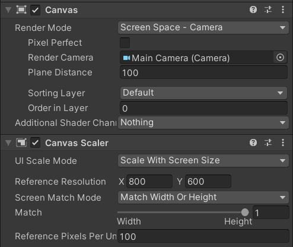
2. Create an empty gameobject as the child of the canvas plane, rename it to "CircularScrollingList" (or another name you like), and attach the script `ListPositionCtrl.cs` to it. \
    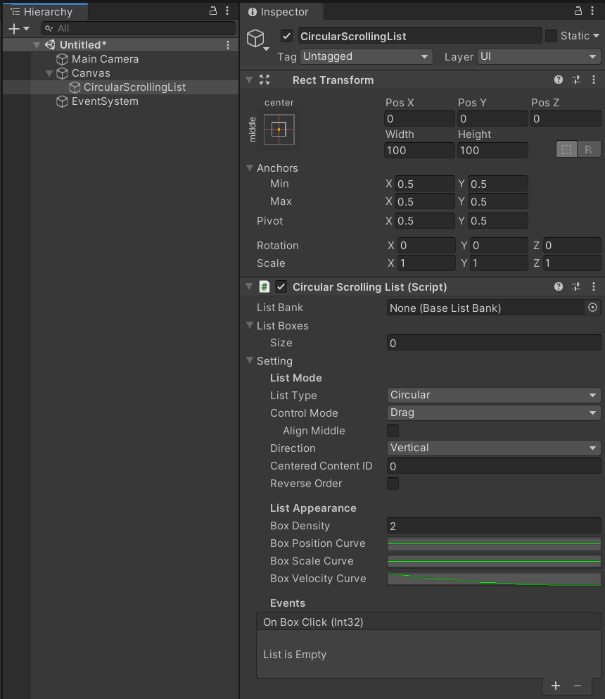
3. Create a Button gameobject as the child of the "CircularScrollingList", rename it to "ListBox", change the sprite and the font size if needed. \
    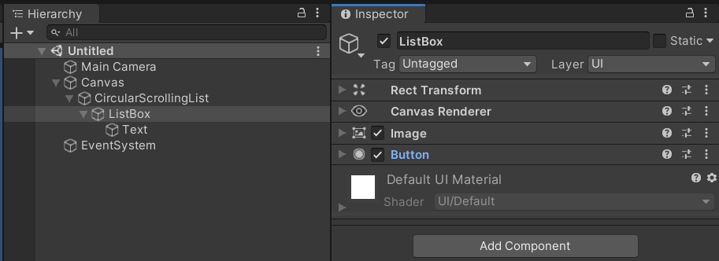
4. Create a new script `IntListBox.cs` and add the following code. For more information, see [ListBank and ListBox](#listbank-and-listbox) section.

    ```csharp
    using AirFishLab.ScrollingList;
    using UnityEngine;
    using UnityEngine.UI;

    // The box used for displaying the content
    // Must be inherited from the class ListBox
    public class IntListBox : ListBox
    {
        [SerializeField]
        private Text _contentText;

        // This function is invoked by the `CircularScrollingList` for updating the list content.
        // The type of the content will be converted to `object` in the `IntListBank` (Defined later)
        // So it should be converted back to its own type for being used.
        // The original type of the content is `int`.
        protected override void UpdateDisplayContent(object content)
        {
            _contentText.text = ((int) content).ToString();
        }
    }
    ```

5. Attach the script `IntListBox.cs` to it, assign the gameobject "Text" of the Button to the "Content Text" of the `ListBox.cs`, and then create a prefab of it .\
    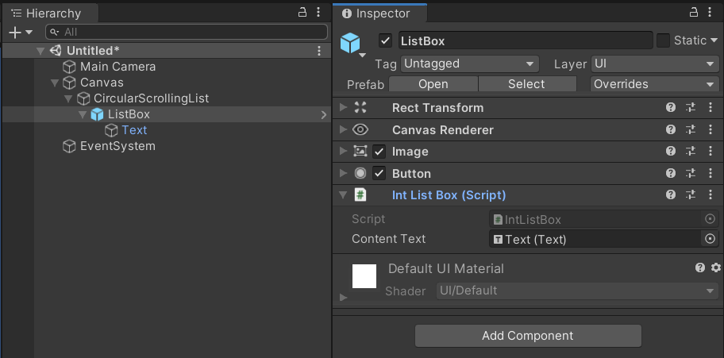
6. Duplicate the gameobject `ListBox` or create gameobjects from the prefab as many times as you want (4 times here, for exmaple) \
    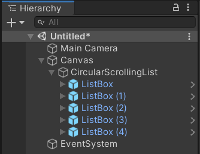
7. Click the menu of the `CircularScrollingList` and select "Assign References of Bank and Boxes" to automatically add the reference of boxes to it (The list boxes must be the children of `CircularScrollingList`), or maually assign them to the property "List Boxes". \
    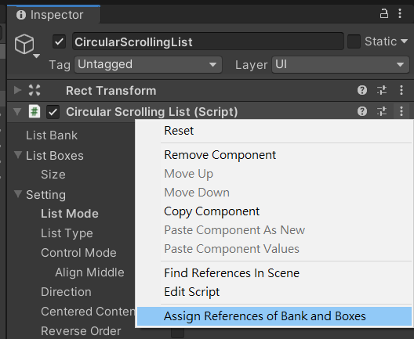
    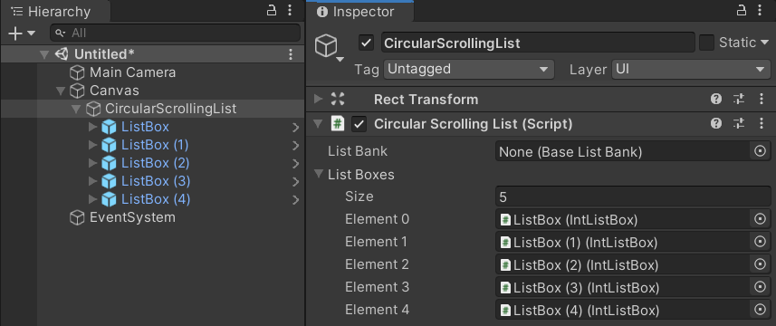
8. Create a new script `IntListBank.cs` and add the following code. For more information, see [ListBank and ListBox](#listbank-and-listbox) section.

    ```csharp
    using AirFishLab.ScrollingList;

    // The bank for providing the content for the box to display
    // Must be inherit from the class BaseListBank
    public class IntListBank : BaseListBank
    {
        private readonly int[] _contents = {
            1, 2, 3, 4, 5, 6, 7, 8, 9, 10
        };

        // This function will be invoked by the `CircularScrollingList`
        // when acquiring the content to display
        // The object returned will be converted to the type `object`
        // which will be converted back to its own type in `IntListBox.UpdateDisplayContent()`
        public override object GetListContent(int index)
        {
            return _contents[index];
        }

        public override int GetListLength()
        {
            return _contents.Length;
        }
    }
    ```

9. Attach the script `IntListBank.cs` to the gameobject "CircularScrollingList" (or another gameobejct you like)
10. Again click the menu of the `CircularScrollingList` and select "Assign References of Bank and Boxes" to automatically add the reference of `IntListBank` to it (The script must be in the same gameobject of the `CircularScrollingList`), or manually assign it to the property "List Bank". \
    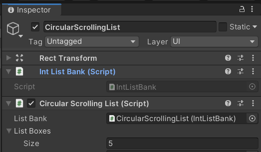
11. Adjust the height or width of the rect transform of the gameobject "CircularScrollingList". When the game is running, the list boxes will be evenly distributed in the range of height (for **Vertically** scrolling list) or width (for **Horizontally** scrolling list). \
    The distance between the boxes can be adjusted by the property "Box Density". \
    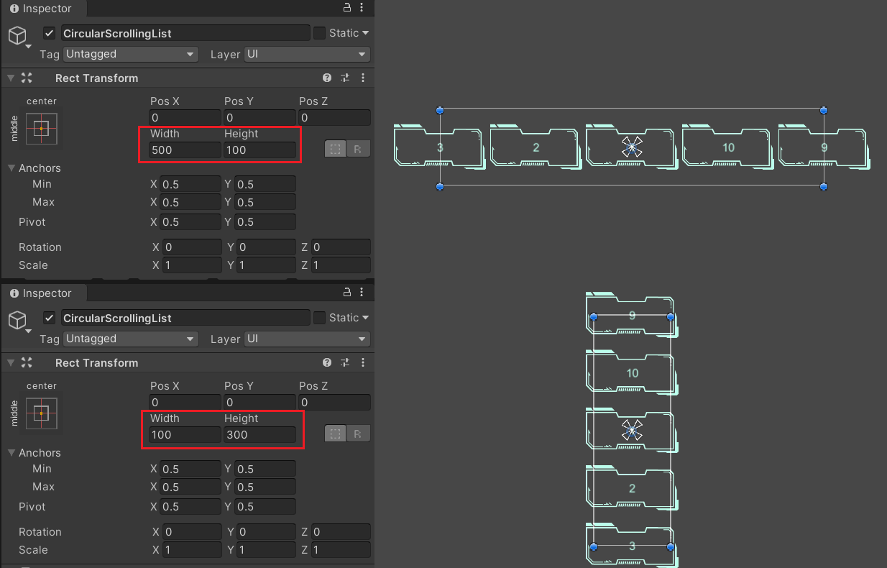
12. Click "Play" to see the result

### Set the Control Mode

There are 3 control mode for the list:

* **Drag**: The list can be moved by dragging it.
* **Function**: The list can be moved by invoking `CircularScrollingList.MoveOneUnitUp()` or `CicularScrollingList.MoveOneUnitDown()`. \
  For the **horizontally** scolling list, invoking `CircularScrollingList.MoveOneUnitUp()` will move the list one unit right, and one unit left by invoking `CicularScrollingList.MoveOneUnitDown()`. \
  In this mode, the list can be moved by additional buttons by assigning these two function to them. \
  
* **Mouse Wheel**: The list can be moved by scrolling the mouse wheel.

### Appearance Curves

* **Box Position Curve**: The curve specifying the passive position of the box
  * X axis: The major position of the box, which is mapped to [-1, 1] (from the smallest value to the largest value).
  * Y axis: The factor of the passive position.

  For example, in the vertical mode, the major position is the y position and the passive position is the x position: \
   \
  It is intuitive in the horizontal mode: \
   \
  Note that "1" in the curve equals to (number of boxes / 2) * unitPos, where unitPos equals to (width/length of rect / (number of boxes - 1)).
* **Box Scale Curve**: The curve specifying the box scale
  * X axis: Same as the box position curve
  * Y axis: The scale value of the box at that major position
* **Box Velocity Curve**: The curve specifying the velocity factor of the box after releasing
  * X axis: The movement duration in seconds, which starts from 0.
  * Y axis: The factor relative to the releasing velocity

  The y value of curve should **start from 1 and end with 0**. \
  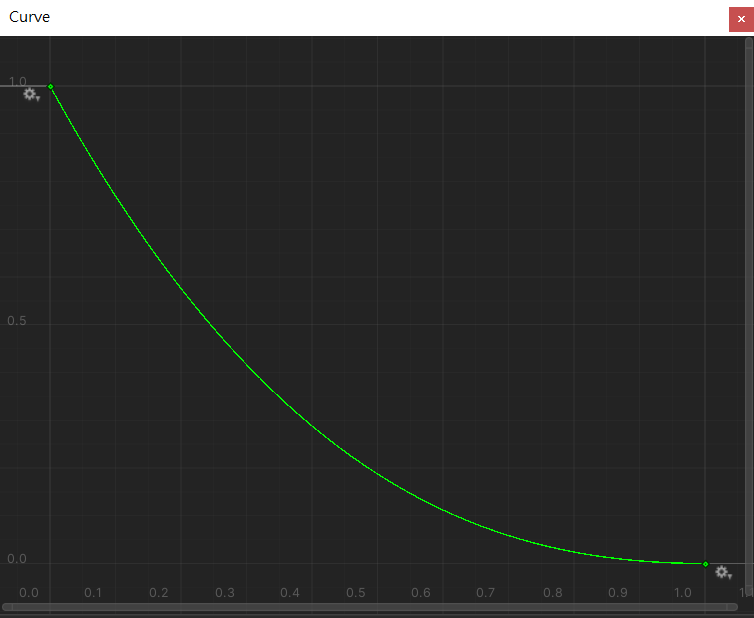
* **Box Movement Curve**: The curve specifying the movement factor of the box. 
  * X axis: Same as the box velocity curve
  * Y axis: The factor relative to the target position.

  The y value of curve should **start from 0 and end with 1**. \
  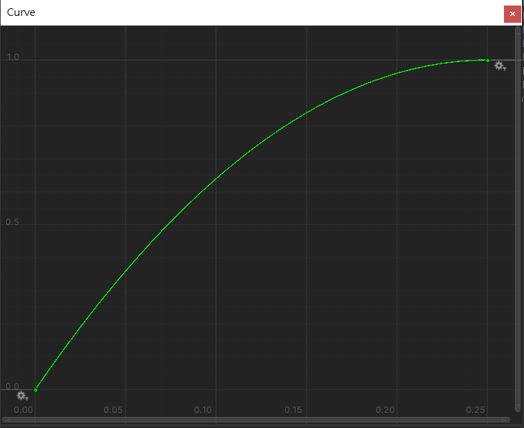

#### Curve Presets

The project provides curve presets. Open the curve editing panel and select the `BoxCurvePresets` to use them. \
 \
 \
Part A are position curves, part B are scale curves, part C is a velocity curve, and part D is a movement curve.

## `ListBank` and `ListBox`

Scene version 5, the list supports custom content type. Different type of `ListBank` and `ListBox` can be used in the different list. In this section mentions how to implement your own `ListBank` and `ListBox`.


### Custom `ListBank`

Here is the example of the custom `ColorStrListBank`:

```csharp
public class ColorStrListBank : BaseListBank
{
    [SerializeField]
    private ColorString[] _contents;

    public override object GetListContent(int index)
    {
        return _contents[index];
    }

    public override int GetListLength()
    {
        return _contents.Length;
    }
}

[Serializable]
public class ColorString
{
    public Color color;
    public string name;
}
```

The class must inherit from the class `BaseListBank`, and there are 2 methods to be implemented:

* `public override object GetListContent(int index)`: The function for the list to request the content to display. This function always convert the returned content to type `object`, and it should be converted back to its orignal type for being used in the custom `ListBox`.
* `public override int GetListLength()`: Get the number of the contents.

### Custom `ListBox`

Here is the example of the corresponding `ColorStrListBox`:

```csharp
using AirFishLab.ScrollingList;
using UnityEngine;
using UnityEngine.UI;

public class ColorStrListBox : ListBox
{
    [SerializeField]
    private Image _contentImage;
    [SerializeField]
    private Text _contentText;

    protected override void UpdateDisplayContent(object content)
    {
        var colorString = (ColorString) content;
        _contentImage.color = colorString.color;
        _contentText.text = colorString.name;
    }
}
```

The class must inherit from the class `ListBox`, and there are 1 method to be implemented:

* `protected override void UpdateDisplayContent(object content)`: The function for the list to update the content of the box. `content` is the content requested from the custom list bank, and it should be converted back to its original type for being used.

### Use Them in the List

Same as the setup steps in the [Set up the List](#set-up-the-list) section but replacing the `IntListBox` and `IntListBank` with your own version of `ListBox` and `ListBank`.

 \


### Avoid Boxing/Unboxing Problem

According to [this C# programming guide](https://docs.microsoft.com/en-us/dotnet/csharp/programming-guide/types/boxing-and-unboxing), converting a value type to `object` type is called boxing, and converting `object` type to a value type is called unboxing, which causes a performance problem. To avoid this situation, create a data class to carry the data of value type.

The modified version of `IntListBank`:

```csharp
using AirFishLab.ScrollingList;

public class IntListBank : BaseListBank
{
    private readonly int[] _contents = {
        1, 2, 3, 4, 5, 6, 7, 8, 9, 10
    };

    // Create a data wrapper for carrying the data
    private DataWrapper _dataWrapper = new DataWrapper();

    public override object GetListContent(int index)
    {
        _dataWrapper.value = _contents[index];
        return _dataWrapper;
    }

    public override int GetListLength()
    {
        return _contents.Length;
    }
}

public class DataWrapper
{
    public int value;
}
```

The modified version of `IntListBox`:

```csharp
using AirFishLab.ScrollingList;

public class IntListBox : ListBox
{
    [SerializeField]
    private Text _contentText;

    protected override void UpdateDisplayContent(object content)
    {
        var data = (DataWrapper) content;
        _contentText.text = (string) data.value;
    }
}
```

## Get the ID of the Selected Content

There are three ways to get ID of the selected content.

1. `OnBoxClicked` event
2. `OnCenteredContentChanged` event
3. Manually get the centered content ID

### `OnBoxClick` Event

When a box is clicked, the `CircularScrollingList` will launch the event `OnBoxClick` (actually launch from the `Button.onClick` event). The callback function (or the listener) for the event must have 1 parameter for receiving the ID of the selected content.

Here is an example of the callback function:

```csharp
using AirFishLab.ScrollingList;

public class DisplayAndSelectExample : MonoBehaviour
{
    [SerializeField]
    private CircularScrollingList _list;

    public void GetSelectedContentID(int selectedContentID)
    {
        var content = (int) _list.listBank.GetListContent(selectedContentID);
        Debug.Log("Selected content ID: " + selectedContentID +
                ", Content: " + content);
    }
}
```

Then, assign it to the property "On Box Click (Int 32)". (Note that select the function in the "dynamic int" section) \
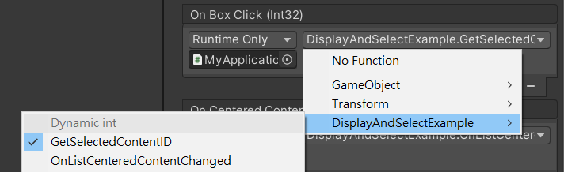

It will be like: \


### `OnCenteredContentChanged` Event

The `OnCenteredContentChanged` event will be invoked when the centered content is changed. The callbacks for this event are similar to the `OnBoxClicked` event.

Here is an example of the callback function:

```csharp
using AirFishLab.ScrollingList;

public class DisplayAndSelectExample : MonoBehaviour
{
    [SerializeField]
    private CircularScrollingList _list;
    [SerializeField]
    private Text _centeredContentText;

    public void OnListCenteredContentChanged(int centeredContentID)
    {
        var content = (int) _list.listBank.GetListContent(centeredContentID);
        _centeredContentText.text = "(Auto updated)\nCentered content: " + content;
    }
}
```

Assign it to the property "On Centered Content Changed (Int 32)" \
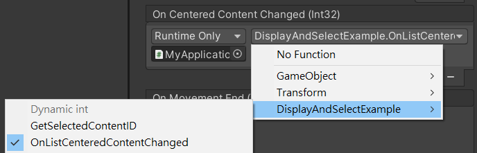

It will be like: \
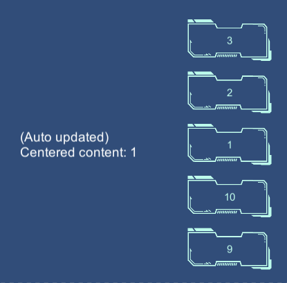

### Manually Get the Centered Content ID

The other way is to invoke the function `CircularScrollingList.GetCenteredContentID()` to manually get the centered content ID.

For example, create a function which will update the content of the centered box to the Text, and use a Button to invoke it.

```csharp
using AirFishLab.ScrollingList;

public class DisplayAndSelectExample : MonoBehaviour
{
    [SerializeField]
    private CircularScrollingList _list;
    [SerializeField]
    private Text _displayText;

    public void DisplayCenteredContent()
    {
        var contentID = _list.GetCenteredContentID();
        var centeredContent = (int) _list.listBank.GetListContent(contentID);
        _displayText.text = "Centered content: " + centeredContent;
    }
}
```

It will be like: \


## Select the Content from Script

The list content could be selected from the script by invoking:

```csharp
CircularScrollingList.SelectContentID(int contentID)
```

Whether the "Centered Selected Box" is on or off, the selected content will always be centered. \
If the specified `contentID` is not valid, it will raise `IndexOutOfRangeException`. It the list has no content to display, this function has no effect, no matter what the value of `contentID` is.

Here is an example for iteration through the list contents by selecting each content:

```csharp
using AirFishLab.ScrollingList;

public class ListIteration : MonoBehaviour
{
    [SerializeField]
    private CircularScrollingList _list;
    [SerializeField]
    private float _stepInterval = 0.1f;

    private int _currentID;

    private void Start()
    {
        StartCoroutine(IterationLoop());
    }

    private IEnumerator IterationLoop()
    {
        while (true) {
            _list.SelectContentID(_currentID);
            _currentID =
                (int) Mathf.Repeat(_currentID + 1, _list.listBank.GetListLength());
            yield return new WaitForSeconds(_stepInterval);
        }
    }
}
```

It will be like: \


## Refresh the List

When any content in the list bank is changed, make the list refresh its displaying contents by invoking:

```csharp
CircularScrollingList.Refresh(int centeredContentID = -1)
```

The boxes in the list will recalculate their content ID and reacquire the content from the list bank. \
The `centeredContentID` specifies the ID of the centered content after the list is refreshed. If it's value is invalid, the function will raise `IndexOutOfRangeException`. \
If the `centeredContentID` is negative, whose defalut value is -1, the list will use the current centered content ID as the content ID of the centered box (Note that it uses ID, not content). If the current centered content ID is larger than the number of contents, it will be the ID of the last item of them. If there is no content to be displayed before calling `Refresh()`, the ID of the centered content will be 0.

Here is an example for extracting new contents and refresh the list:

```csharp
using AirFishLab.ScrollingList;

public class VariableStringListBank : BaseListBank
{
    [SerializeField]
    private InputField _contentInputField;
    [SerializeField]
    private string[] _contents = {"a", "b", "c", "d", "e"};
    [SerializeField]
    private CircularScrollingList _list;

    /// <summary>
    /// Extract the contents from the input field and refresh the list
    /// </summary>
    /// This function is assigned to a button.
    public void ChangeContents()
    {
        _contents =
            _contentInputField.text.Split(
                new[] {',', ' '}, StringSplitOptions.RemoveEmptyEntries);
        _list.Refresh();
    }

    public override object GetListContent(int index)
    {
        return _contents[index];
    }

    public override int GetListLength()
    {
        return _contents.Length;
    }
}
```

It will be like: \

