# Circular Scrolling List

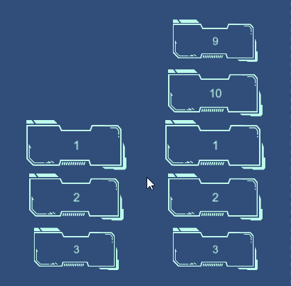

The quick overview of version 6 - [Demo video](https://youtu.be/6y-_MaeWIAg)

## Outline

- [Circular Scrolling List](#circular-scrolling-list)
  - [Outline](#outline)
  - [Features](#features)
  - [Setting](#setting)
    - [Box Setting](#box-setting)
    - [List Setting](#list-setting)
      - [List Mode](#list-mode)
      - [List Appearance](#list-appearance)
      - [List Events](#list-events)
  - [How to Use](#how-to-use)
    - [Setup the List](#setup-the-list)
    - [Set the Layout Area](#set-the-layout-area)
    - [Set the Control Mode](#set-the-control-mode)
    - [Set the Focusing Position](#set-the-focusing-position)
    - [Appearance Curves](#appearance-curves)
      - [Curve Presets](#curve-presets)
  - [`ListBank` and `ListBox`](#listbank-and-listbox)
    - [Custom `ListBank`](#custom-listbank)
    - [Custom `ListBox`](#custom-listbox)
    - [Use Them in the List](#use-them-in-the-list)
    - [Pass Data of Primitive Type](#pass-data-of-primitive-type)
  - [List Events](#list-events-1)
    - [`OnBoxSelected` Event](#onboxselected-event)
    - [`OnFocusingBoxChanged` Event](#onfocusingboxchanged-event)
    - [Manually Get the Focusing Box](#manually-get-the-focusing-box)
    - [`OnMovementEnd` event](#onmovementend-event)
  - [Box Events](#box-events)
    - [`OnInitialized` event](#oninitialized-event)
    - [`OnBoxMoved` event](#onboxmoved-event)
  - [Script Operations](#script-operations)
    - [Late Initialization](#late-initialization)
    - [Toggle List Interaction](#toggle-list-interaction)
    - [Select the Content](#select-the-content)
    - [Refresh the List](#refresh-the-list)
    - [Stop the Movement](#stop-the-movement)

## Features

- Use finite list boxes to display infinite contents
- 2 list types: Circular or Linear mode
- 3 control modes: Pointer, Mouse wheel, and Script
- 3 focusing position: Top, Center, and Bottom
- Support both vertical and horizontal scrolling
- Support all three render modes of the canvas plane
- Custom layout and movement, and layout preview in the editor
- Custom displaying contents
- Support dynamic list contents
- Support interaction via the script - Content selection, toggle interaction state, etc.
- Runtime setup and initialization
- Image sorting - The focused box will be popped up
- Provide callback events
- Support Unity 2018.4+ (Tested in Unity 2018.4.15f1. The demo scenes in the project are made in Unity 2019.4.16f1)

## Setting

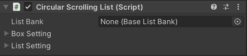

|Property|Description|
|:-------|:----------|
|**List Bank**|The game object that stores the contents for the list to display|
|**Box Setting**|The setting of the list box. See [Box Setting](#box-setting) section|
|**List Setting**|The setting of the list. See [List Setting](#list-setting) section|

### Box Setting

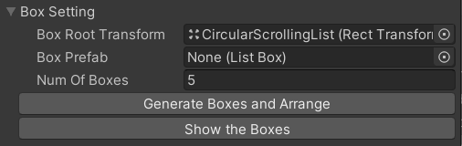

|Property|Description|
|:-------|:----------|
|**Box Root Transform**|The root rect transform that holding the list boxes.<br>Default to the gameobject where the script is attached to|
|**Box Prefab**|The prefab of the list box|
|**Num Of Boxes**|The number of boxes to be generated|
|**Generate Boxes and Arrange**|Generate the boxes under the "Box Root Transform" and<br>arrange them according to the [list appearance](#list-appearance)|
|**Show/Hide the Boxes**|Show or hide the reference of managed boxes|

The managed boxes will be shown when click the "Show the Boxes" button, and be hidden by clicking the button again: \
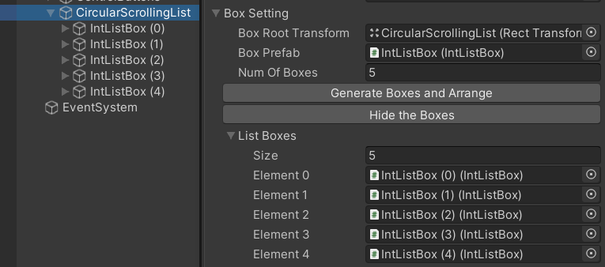

### List Setting

#### List Mode


|Property|Description|
|:-------|:----------|
|**List Type**|The type of the list. Could be **Circular** or **Linear**|
|**Direction**|The major scrolling direction. Could be **Vertical** or **Horizontal**|
|**Control Mode**|The controlling mode. Could be **Nothing**, or **Everthing**, **Pointer**, and **Mouse Wheel**<br>See [Set the Control Mode](#set-the-control-mode) for more information|
|┕ **Align At Focusing Position**|Whether to align a box at the focusing position after sliding or not.<br>Available if the control mode has **Pointer** set.|
|┕ **Reverse Scrolling Direction**|Whether to reverse the scrolling direction or not.<br>Available if the control mode has **Mouse Wheel** set.|
|**Focusing Position**|The focusing (ending) position of the list. Could be **Top**, **Center**, or **Bottom**<br>See [Set the Focusing Position](#set-the-focusing-position) for more information|
|┕ **Reverse Content Order**|Whether to reverse the content displaying order or not.<br>Available if the focusing position is **Center**.|
|**Init Focusing Content ID**|The initial content ID to be displayed in the focusing box|
|**Focus Selected Box**|Whether to move the selected box to the focusing position or not.<br>The list box must be a button to make this function take effect.|
|**Initialize On Start**|Whether to initialize the list in its `Start()` or not<br>If it is false, manually initialize the list by invoking `CircularScrollingList.Initialize()`|

#### List Appearance

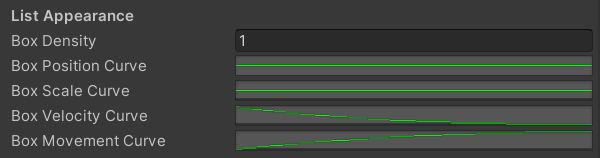

|Property|Description|
|:-------|:----------|
|**Box Density**|The factor for adjusting the distance between boxes.<br>The larger, the closer|
|**Box Position Curve**|The curve specifying the minor position of the box|
|**Box Scale Curve**|The curve specifying the box scale|
|**Box Velocity Curve**|The curve specifying the velocity factor of the box after releasing.<br>Available if the control mode has **Pointer** set.|
|**Box Movement Curve**|The curve specifying the movement factor of the box|

For the detailed information of the curves, see [Appearance Curves](#appearance-curves).

#### List Events

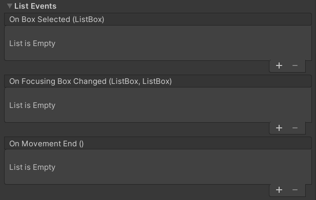

|Property|Description|
|:-------|:----------|
|**On Box Selected**|The callback to be invoked when a box is selected by clicking.<br>The `ListBox` parameter is the selected box.|
|**On Focusing Box Changed**|The callback to be invoked when the focusing box is changed.<br>The first parameter is the previous focusing box,<br>and the second parameter is the current one.|
|**On Movement End**|The callback to be invoked when the list movement is ended|

## How to Use

### Setup the List

1. Add a Canvas plane to the scene. Set the render mode to "Screen Space - Camera" for example, and assign the "Main Camera" to the "Render Camera". Set the ui scale mode to "Scale With Screen Size", and the "Match" to 1. \
    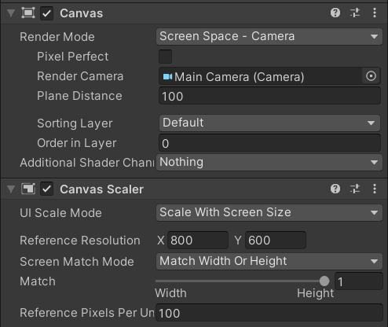
2. Create an empty gameobject as the child of the canvas plane, rename it to "CircularScrollingList" (or other name you like), and set the height to 400. It will define the reference area of the list (See [Set the Layout Area](#set-the-layout-area) for more information). Then attach the script `ListPositionCtrl.cs` to it. \
    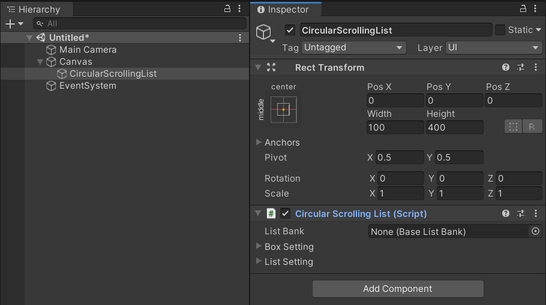
3. Create a Button gameobject as the child of the "CircularScrollingList", rename it to "ListBox", and adjust the image or text size if needed. \
    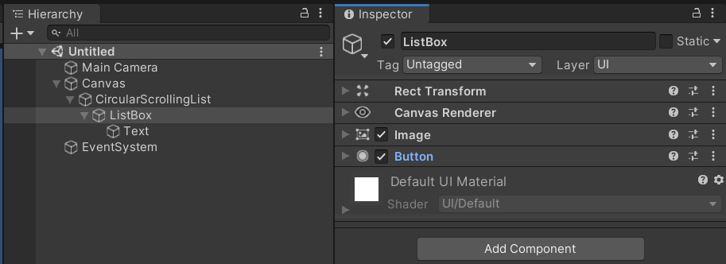
4. Create a new script `IntListBox.cs` and add the following code. For more information, see [ListBank and ListBox](#listbank-and-listbox) section.

    ```csharp
    using AirFishLab.ScrollingList.ContentManagement;
    using UnityEngine;
    using UnityEngine.UI;

    // The box used for displaying the content
    // Must inherit from the class `ListBox`
    public class IntListBox : ListBox
    {
        [SerializeField]
        private Text _contentText;

        // This function is invoked by the `CircularScrollingList` for updating the list content.
        protected override void UpdateDisplayContent(IListContent listContent)
        {
            // Code will be added later
        }
    }
    ```

5. Attach the script `IntListBox.cs` to it, assign the gameobject "Text" of the Button to the "Content Text" of the `ListBox.cs`, and then create a prefab of it.\
    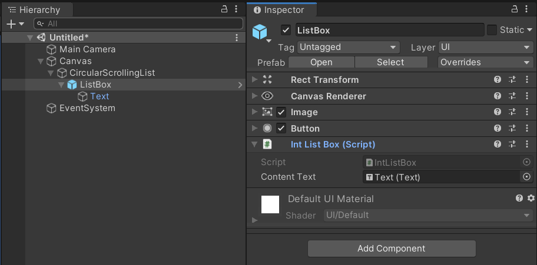
6. Assign the created prefab to the "Box Prefab" in the "Box Setting" of the `CircularScrollingList.cs`. \
    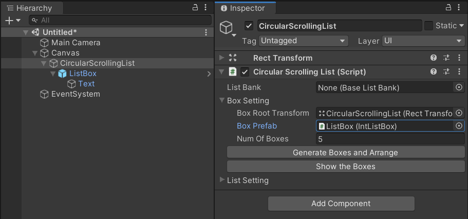
7. Click the "Generate Boxes and Arrange" button, and 4 more boxes will be generated and arranged. Click "Show the Boxes" button to view the referenced boxes. \
    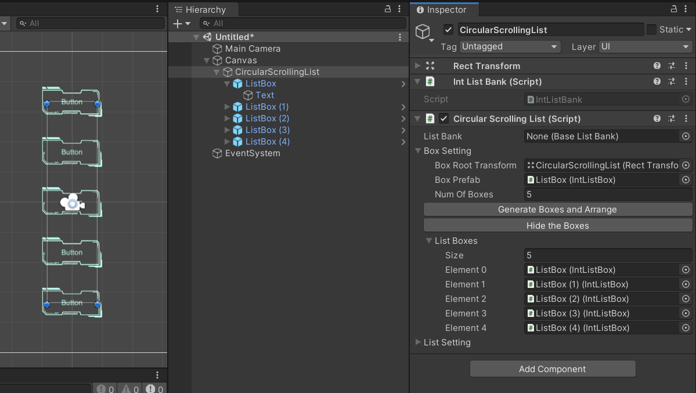
8. Create a new script `IntListBank.cs` and add the following code. For more information, see [ListBank and ListBox](#listbank-and-listbox) section.

    ```csharp
    using AirFishLab.ScrollingList.ContentManagement;

    // The bank for providing the content for the box to display
    // Must be inherit from the class BaseListBank
    public class IntListBank : BaseListBank
    {
        // The content to be passed to the list box
        // must inherit from the class `IListContent`.
        public class Content : IListContent
        {
            public int Value;
        }

        private readonly int[] _contents = {
            1, 2, 3, 4, 5, 6, 7, 8, 9, 10
        };

        // This function will be invoked by the `CircularScrollingList`
        // to get the content to display.
        public override IListContent GetListContent(int index)
        {
            var content = new Content {
                Value = _contents[index]
            };

            return content;
        }

        public override int GetContentCount()
        {
            return _contents.Length;
        }
    }
    ```

9. In the script `IntListBox.cs`, add the code to the function `UpdateDisplayContent()` to receive the content.

    ```csharp
    using AirFishLab.ScrollingList.ContentManagement;
    using UnityEngine;
    using UnityEngine.UI;

    // The box used for displaying the content
    // Must inherit from the class `ListBox`
    public class IntListBox : ListBox
    {
        [SerializeField]
        private Text _contentText;

        // This function is invoked by the `CircularScrollingList` for updating the list content.
        protected override void UpdateDisplayContent(IListContent listContent)
        {
            var content = (IntListBank.Content)listContent;
            _contentText.text = content.Value;
        }
    }
    ```

10. Attach the script `IntListBank.cs` to the gameobject "CircularScrollingList" (or another gameobejct you like), and assign the reference to the "List Bank" of the `CircularScrollingList.cs`. \
    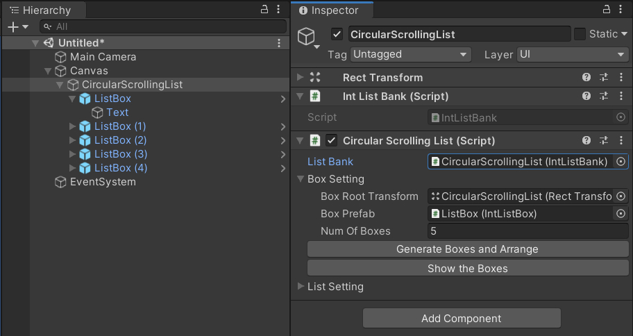
11. Click "Play" to see the result

### Set the Layout Area

*Related demo scene: 01-ListType*

The rect size of the given "Box Root Transform" defines the layout area. If the direction of the list is **Vertical**, the list will use the height of the rect size to arrange the boxes. If the direction of the list is **Horizontal**, the list will use the width instead. \
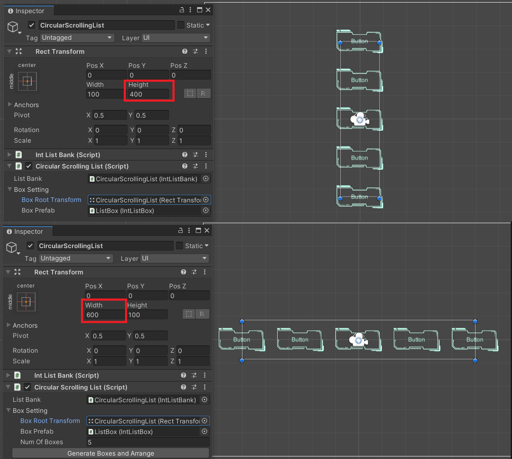

The gap between the boxes could be adjusted by setting the "Box Density" in the "List Appearence" section of the setting. The higher, the closer. \
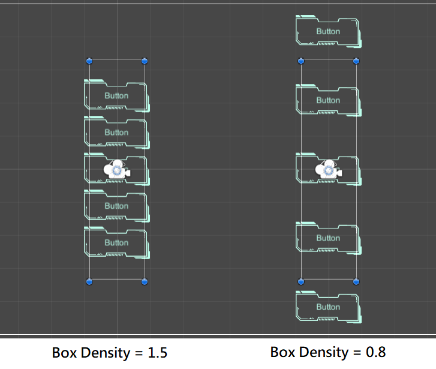

### Set the Control Mode

*Related demo scene: 02-ControlMode*

There are 3 control modes. Two of them could be toggled in the setting. \
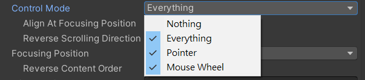

- **Pointer**: The list can be moved by dragging it.
  - **Align At Focusing Position** option will be shown if this control mode is set. If it is activated, the list will align a box to the focusing position after the list is released.
- **Mouse Wheel**: The list can be moved by scrolling the mouse wheel.
  - **Reverse Scrolling Direction** option will be shown if this contol mode is set. If it is activated, the list will be scrolled in the reversed direction.

The last control mode is **Function**. The list can be moved by invoking `CircularScrollingList.MoveOneUnitUp()` or `CircularScrollingList.MoveOneUnitDown()`. In this mode, the list can be moved by buttons which invoking these two functions. \
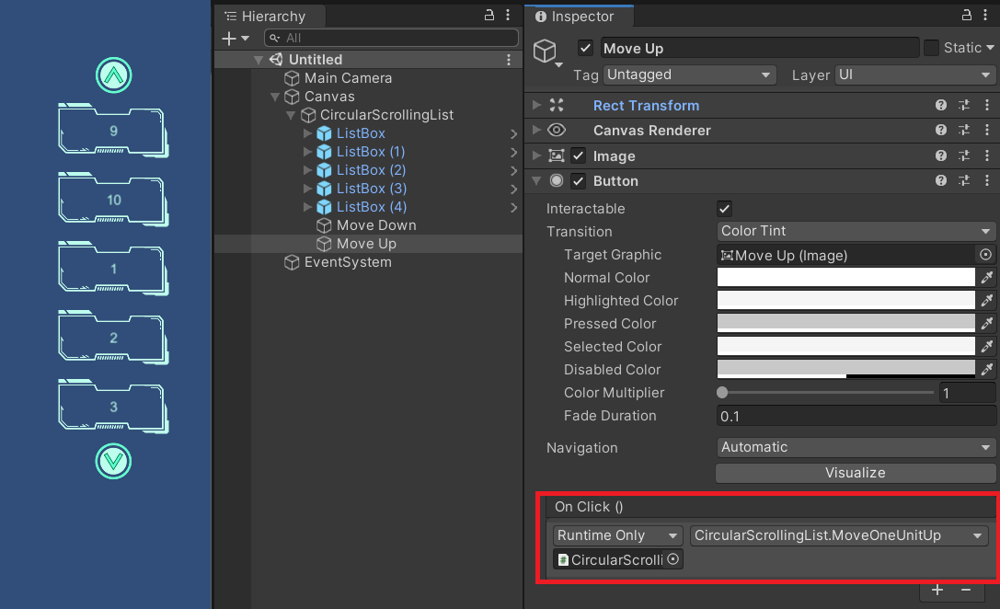

### Set the Focusing Position

*Related demo scene: 03-FocusingPosition*

The focusing position defines which box will be the focusing box at that position. The **Reverse Content Order** option will be shown if the focusing position is set to **Center**. \
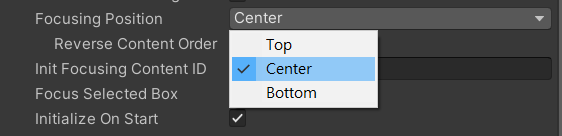

Here is the focusing position related to the position of the box. The focusing position will affect the result of the `OnFocusingBoxChanged` event. \
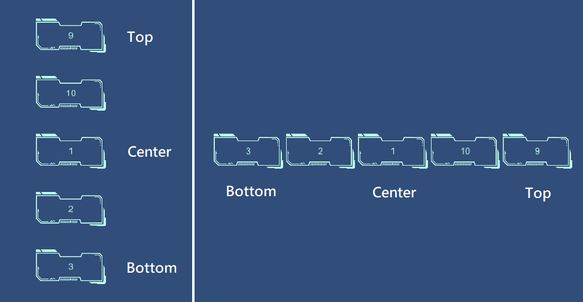

If the focusing position is set to **Top**, the order of the displaying content will be from the top to the bottom. If it is **Bottom**, the order will be reversed. If it is **Center**, the order is decided by the **Reverse Content Order** option. \
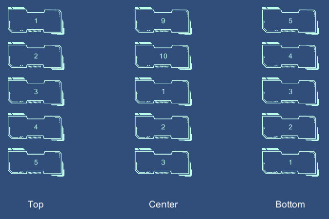

The focusing position also defines the ending position of the **Linear** list. If it is set to **Top**, the list will be ended at the bottom. If it is set to **Bottom**, the list will be ended at the top. That is, unlike **Center** focusing position, the box showing the last content couldn't be dragged to the focusing position. \
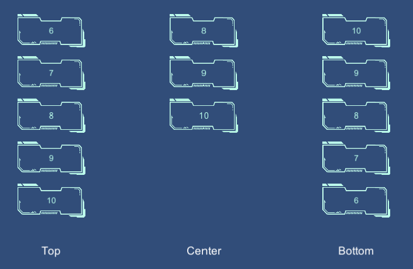

But if the number of the content is less than the number of the boxes, the content will be shown from the focusing position, and the list couldn't be dragged, when the focusing position is set to **Top** or **Bottom**. \
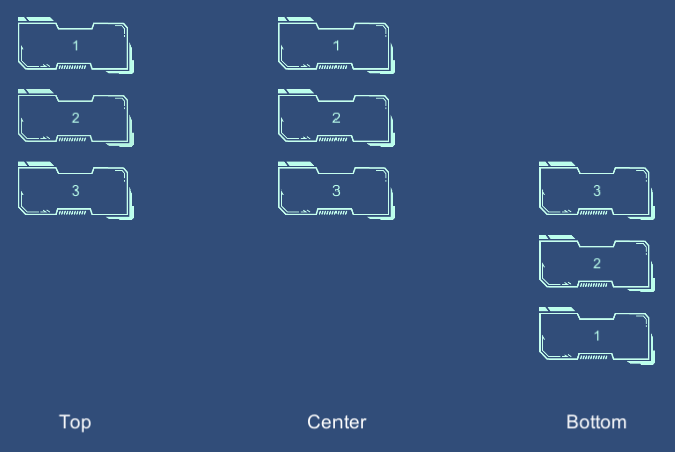

### Appearance Curves

*Related demo scene: 04-LayoutAndMovement*

- **Box Position Curve**: The curve specifying the minor position of the box
  - X axis: The major position of the box, which is mapped to [-1, 1] (from the smallest major position to the largest major position).
  - Y axis: The factor of the minor position.

  For example, in the vertical mode, the major position is the y position and the minor position is the x position: \
  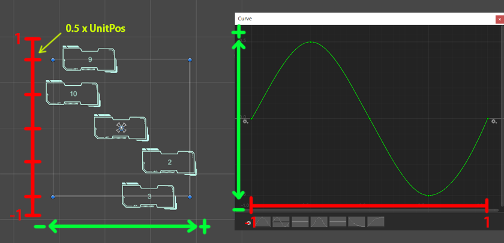 \
  It is intuitive in the horizontal mode: \
  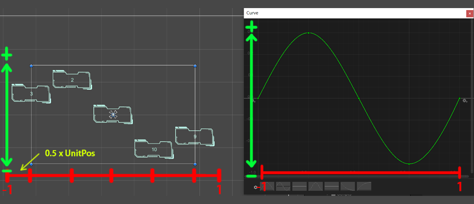 \
  Note that "1" in the curve equals to `(number of boxes / 2) * unitPos`, where unitPos equals to `(width or length of root rect size / (number of boxes - 1))`. For example, if there are 5 boxes, then the length of "1" is 2.5 unitPos. And if the width of the root rect transform is 400, then the unitPos is 100.

- **Box Scale Curve**: The curve specifying the box scale
  - X axis: Same as the box position curve
  - Y axis: The scale value of the box at that major position
- **Box Velocity Curve**: The curve specifying the velocity factor of the box after releasing
  - X axis: The movement duration in seconds, which starts from 0.
  - Y axis: The factor of the releasing velocity. It should **start from 1 and end with 0**. \
  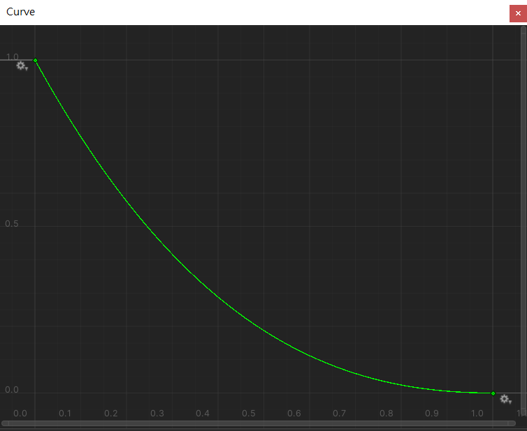
- **Box Movement Curve**: The curve specifying the movement factor of the box.
  - X axis: Same as the box velocity curve
  - Y axis: The lerping factor between current position and the target position. It should **start from 0 and end with 1**. \
  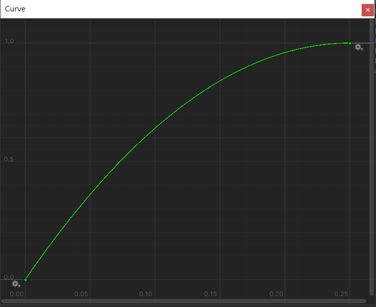

#### Curve Presets

The project provides curve presets. Open the curve editing panel and select the `BoxCurvePresets` to use them. \
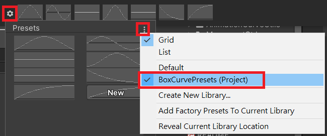 \
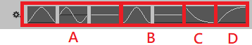 \
Part A are position curves, part B are scale curves, part C is a velocity curve, and part D is a movement curve.

## `ListBank` and `ListBox`

*Related demo scene: 05-CustomContent*

Since version 5, the list supports custom content type. Different type of `ListBank` and `ListBox` can be used in the different list. In this section mentions how to implement your own `ListBank` and `ListBox`.

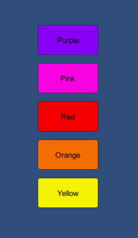

### Custom `ListBank`

Here is the example of the custom `ColorStrListBank`:

```csharp
using System;
using AirFishLab.ScrollingList.ContentManagement;
using UnityEngine;

public class ColorStrListBank : BaseListBank
{
    [SerializeField]
    private ColorString[] _contents;

    public override IListContent GetListContent(int index)
    {
        return _contents[index];
    }

    public override int GetContentCount()
    {
        return _contents.Length;
    }
}

[Serializable]
public class ColorString : IListContent
{
    public Color color;
    public string name;
}
```

The class must inherit from the class `BaseListBank`, and there are 2 methods to be implemented:

- `public override IListContent GetListContent(int index)`: The function for the list to get the content to display. The data object passed by this function should inherit `IListContent`, and it should be converted back to its orignal type for being used in the custom `ListBox`.
- `public override int GetListLength()`: Get the number of the content.

### Custom `ListBox`

Here is the example of the corresponding `ColorStrListBox`:

```csharp
using AirFishLab.ScrollingList.ContentManagement;
using UnityEngine;
using UnityEngine.UI;

public class ColorStrListBox : ListBox
{
    [SerializeField]
    private Image _contentImage;
    [SerializeField]
    private Text _contentText;

    protected override void UpdateDisplayContent(IListContent content)
    {
        // Convert the content type back to the ColorString to get the data
        var colorString = (ColorString)content;
        _contentImage.color = colorString.color;
        _contentText.text = colorString.name;
    }
}
```

The class must inherit from the class `ListBox`, and there is 1 method to be implemented:

- `protected override void UpdateDisplayContent(IListContent content)`: The function for the list to update the content of the box. `content` is the content requested from `GetListContent()` of the custom list bank, and it should be converted back to its original type for being used.

### Use Them in the List

Same as the setup steps in the [Setup the List](#setup-the-list) section but replacing the `IntListBox` and `IntListBank` with your own version of `ListBox` and `ListBank`.

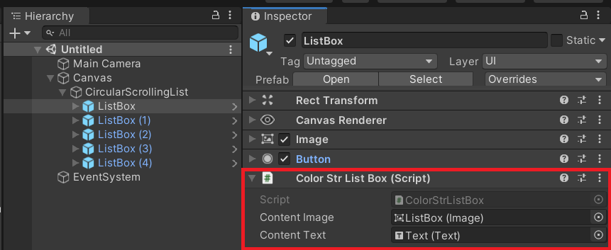 \
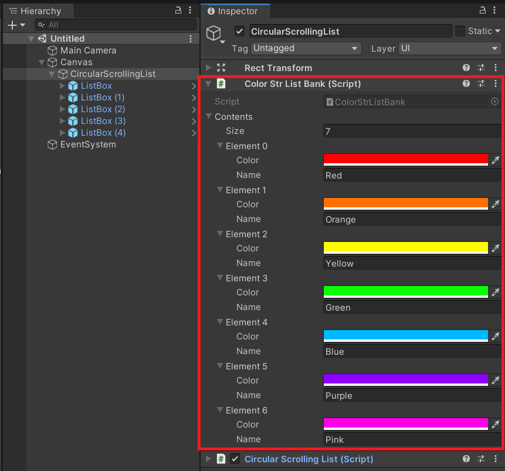

### Pass Data of Primitive Type

If the type of the content is primitive type such as `int` or `string`, you should create a class carrying the data and make it inherit from the `IListContent`.

For example, for passing the string as the content:

```csharp
public class StringListBank : BaseListBank
{
    /// <summary>
    /// Used for carrying the data
    /// </summary>
    public class DataWrapper : IListContent
    {
        public string Data;
    }

    private string[] _contents = {"apple", "book", "car", "door", "egg"};
    // Create a wrapper object for carrying the data
    private DataWrapper _dataWrapper = new DataWrapper();

    public override IListContent GetListContent(int index)
    {
        // Store the content in the data wrapper
        _dataWrapper.Data = _contents[index];
        return _dataWrapper;
    }

    public override int GetContentCount()
    {
        return _contents.Length;
    }
}

public class StringListBox : ListBox
{
    [SerializeField]
    private Text _text;

    protected override void UpdateDisplayContent(IListContent content)
    {
        var dataWrapper = (StringListBank.DataWrapper)content;
        // Extract the content from the wrapper
        _text.text = dataWrapper.Data;
    }
}
```

## List Events

*Related demo scene: 06-ListEvents*

All the events could be subscribed or unsubscribed by script by invoking:

```csharp
CircularScrollingList.ListSetting.AddXXXCallback(callback)
CircularScrollingList.ListSetting.RemoveXXXCallback(callback)
```

### `OnBoxSelected` Event

When a box is clicked, the list will launch the `OnBoxSelected` event (actually launch from the `Button.onClick` event). The callback function (or the listener) for the event must have 1 parameter for receiving the focusing box.

Here is an example of the callback function:

```csharp
using AirFishLab.ScrollingList;
using UnityEngine;
using UnityEngine.UI;

public class ListEventDemo : MonoBehaviour
{
    [SerializeField]
    private CircularScrollingList _list;
    [SerializeField]
    private Text _selectedContentText;

    public void OnBoxSelected(ListBox listBox)
    {
        var contentID = listBox.ContentID;
        // Get the content by the content ID
        var content = (IntListContent)_list.ListBank.GetListContent(contentID);
        _selectedContentText.text =
            $"Selected content ID: {contentID}, Content: {content}";
    }

    public void OnBoxSelected2(ListBox listBox)
    {
        // The other way is to convert the type of the box back to its original type,
        // and then get the custom property from the box
        var customBox = (CustomBox)listBox;
        _selectedContentText.text =
            $"Selected content ID: {customBox.ContentID}, Content: {customBox.Content}";
    }
}
```

Then, assign it to the property "On Box Selected (ListBox)". \
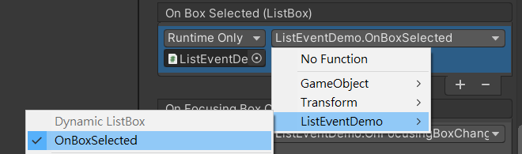

It will be like (ReadmeData~/on-box-selected-event-demo.gif): \
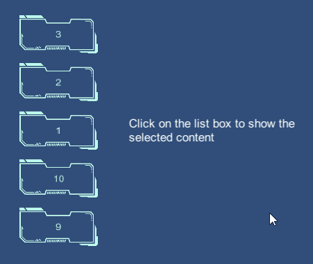

### `OnFocusingBoxChanged` Event

The `OnFocusingBoxChanged` event will be invoked when the box at the specified "Focusing Position" is changed. Two parameters are required for the callback: the last focusing box and the current one.

Here is an example of the callback function:

```csharp
using AirFishLab.ScrollingList;
using UnityEngine;
using UnityEngine.UI;

public class ListEventDemo : MonoBehaviour
{
    [SerializeField]
    private CircularScrollingList _list;
    [SerializeField]
    private Text _autoUpdatedContentText;

    public void OnFocusingBoxChanged(
        ListBox prevFocusingBox, ListBox curFocusingBox)
    {
        var curFocusingIntBox = (IntListBox)curFocusingBox;
        // The `IntListBox` has custom property `Content` for storing the displaying content
        _autoUpdatedContentText.text =
            $"(Auto updated)\nFocusing content: {curFocusingIntBox.Content}";
    }
}
```

Assign it to the property "On Focusing Box Changed (ListBox, ListBox)" \
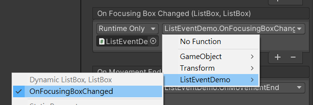

If the "Focusing Position" is set to **Center**, then it will be like (ReadmeData~/on-focusing-box-changed-demo.gif): \
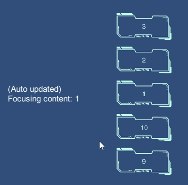

If the "Focusing Position" is set to **Top**, then it will be like (ReadmeData~/on-focusing-box-changed-demo-top-pos.gif): \
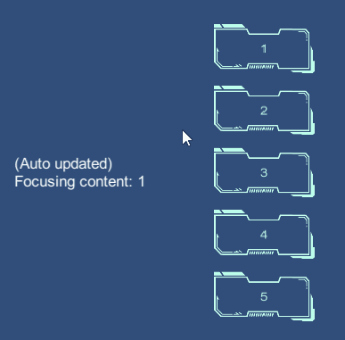

### Manually Get the Focusing Box

Manually get the focusing box by invoking:

```csharp
CircularScrollingList.GetFocusingBox()
```

To get the content id by invoking:

```csharp
CircularScrollingList.GetFocusingContentID()
```

For example, create a function which will update the content of the focusing content to the `Text`, and use a `Button` to invoke it.

```csharp
using AirFishLab.ScrollingList;
using UnityEngine;
using UnityEngine.UI;

public class ListEventDemo : MonoBehaviour
{
    [SerializeField]
    private CircularScrollingList _list;
    [SerializeField]
    private Text _displayText;

    public void DisplayFocusingContent()
    {
        var focusingBox = (IntListBox)_list.GetFocusingBox();
        // The `IntListBox` has custom property `Content` for storing the displaying content
        var focusingContent = focusingBox.Content;
        _displayText.text = "Focusing content: " + focusingContent;
    }
}
```

If the "Focusing Position" is set to **Bottom**, then it will be like (ReadmeData~/get-focusing-box-demo.gif): \
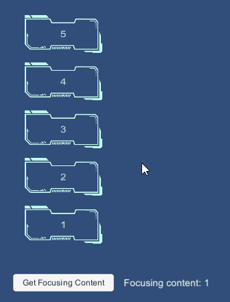

### `OnMovementEnd` event

`OnMovementEnd` event will be invoked when the list stops moving.

## Box Events

The `ListBox.cs` provides some event callbacks. You could define custom behaviour by overriding these event callbacks.

### `OnInitialized` event

`OnInitialized` event is invoked when the list is initialized (`CircularScrollingList.Initialize()`).

```csharp
public class MyListBox : ListBox
{
    protected override void OnInitialized()
    {
        ...
    }
}
```

### `OnBoxMoved` event

`OnBoxMoved` event is invoked when the box is moving. In addition, when the box is initialized.

The event has 1 parameter `positionRatio` which is from -1 to 1.

```csharp
public class MyListBox : ListBox
{
    [SerializedField]
    private Image _image;

    public override void OnBoxMoved(float positionRatio)
    {
        var color = _image.color;
        color.a = 1 - Mathf.Abs(positionRatio);
        _image.color = color;
    }
}
```

## Script Operations

### Late Initialization

*Related demo scene: 07-LateInitialization*

If the **Initialize On Start** is not set, the list could be initialized by invoking:

```csharp
CircularScrollingList.Initialize()
```

The setting of the list could be setup before the `Initialize()` call. The `XXX` below is the placeholder of the setting name:

- To set the `ListBank` by invoking `CircularScrollingList.SetListBank()`
- To set the box setting by invoking `CircularScrollingList.BoxSetting.SetXXX()`, such as `SetBoxPrefab()`
- To set the list setting by invoking `CircularScrollingList.ListSetting.SetXXX()`, such as `SetFocusSelectedBox()`
- To register the event callback by invoking `CircularScrollingList.ListSetting.AddXXXCallback()`, such as `AddOnBoxSelectedCallback()`
- To unregister the event callback by invoking `CircularScrollingList.ListSetting.RemoveXXXCallback()`, such as `RemoveOnBoxSelctedCallback()`

The callback registration/unregistration could be invoked at any time. But for other functions, they will print the warning message and ignore the value after `Initialize()` call.

### Toggle List Interaction

*Related demo scene: 11-InteractingByScript*

The list interaction could be toggled by invoking:

```csharp
CircularScrolingList.SetInteractable(bool isInteractable)
```

and the current interaction state could be checked by:

```csharp
CircularScrollingList.IsInteractable
```

Here is an example:

```csharp
public class ListInteraction : MonoBehaviour
{
    [SerializeField]
    private CircularScrollingList _scrollingList;
    [SerializeField]
    private Text _toggleInteractionText;

    public void ToggleListInteractable()
    {
        _scrollingList.SetInteractable(!_scrollingList.IsInteractable);

        var interactingState = _scrollingList.IsInteractable ? "ON" : "OFF";
        _toggleInteractionText.text = $"List interactable: {interactingState}";
    }
}
```

### Select the Content

*Related demo scene: 10-SelectionMovement*

The list content could be selected from the script by invoking:

```csharp
CircularScrollingList.SelectContentID(int contentID, bool notToIgnore = true)
```

Whether the "Focus Selected Box" is on or off, the selected content will always be moved to the focusing position. \
If the specified `contentID` is invalid, it will raise `IndexOutOfRangeException`. It the list has no content to display, this function has no effect, no matter what the value of `contentID` is. \
If the `notToIgnore` is `true`, the selection movement still works even if the list is not interactable. If it is `false`, then this function call will be ignored instead.

Here is an example for iteration through the list contents by selecting each content:

```csharp
using AirFishLab.ScrollingList;

public class ListIteration : MonoBehaviour
{
    [SerializeField]
    private CircularScrollingList _list;
    [SerializeField]
    private float _stepInterval = 0.1f;

    private int _currentID;

    private void Start()
    {
        // Make the list not interactable while it is controlled by the script
        _list.SetInteractable(false);
        StartCoroutine(IterationLoop());
    }

    private IEnumerator IterationLoop()
    {
        while (true) {
            // The selection movement still works even if the list is not interactable.
            // The default value of 'notToIgnore' parameter is true.
            _list.SelectContentID(_currentID);
            _currentID =
                (int)Mathf.Repeat(_currentID + 1, _list.listBank.GetListLength());
            yield return new WaitForSeconds(_stepInterval);
        }
    }
}
```

It will be like (ReadmeData~/list_selection_demo.gif): \
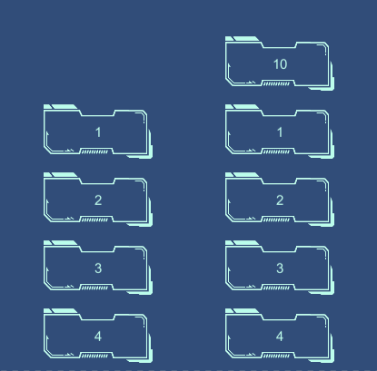

### Refresh the List

*Related demo scene: 08-ListRefreshing*

When the content in the list bank is changed, make the list refresh its displaying contents by invoking:

```csharp
CircularScrollingList.Refresh(int focusingContentID = -1)
```

The boxes in the list will recalculate their content ID and reacquire the content from the list bank. \
The `focusingContentID` specifies the ID of the focusing content after the list is refreshed. If the value is invalid, the function will raise `IndexOutOfRangeException`. \
If the `focusingContentID` is negative, whose defalut value is -1, the list will use the current focusing content ID as the content ID of the focusing box (Note that it uses the ID, not content). If the current focusing content ID is larger than the number of contents, it will be the ID of the last content. If there is no content to be displayed before calling `Refresh()`, the focusing content ID will be 0.

Here is an example for extracting new contents and refresh the list:

```csharp
using AirFishLab.ScrollingList;

public class VariableStringListBank : BaseListBank
{
    [SerializeField]
    private InputField _contentInputField;
    [SerializeField]
    private string[] _contents = {"a", "b", "c", "d", "e"};
    [SerializeField]
    private CircularScrollingList _list;

    private Content _dataWrapper = new Content();

    /// <summary>
    /// Extract the contents from the input field and refresh the list
    /// </summary>
    /// This function is assigned to a button.
    public void ChangeContents()
    {
        _contents =
            _contentInputField.text.Split(
                new[] {',', ' '}, StringSplitOptions.RemoveEmptyEntries);
        _list.Refresh();
    }

    public override IListContent GetListContent(int index)
    {
        _dataWrapper.Content = _contents[index];
        return _dataWrapper;
    }

    public override int GetListLength()
    {
        return _contents.Length;
    }

    public class Content : IListContent
    {
        public string Value;
    }
}
```

It will be like (ReadmeData~/list_refreshing_demo.gif): \
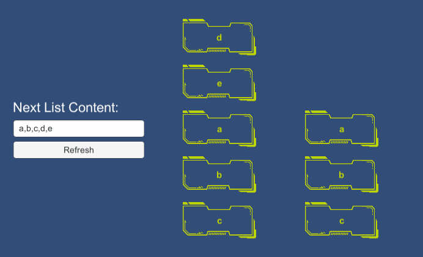

### Stop the Movement

*Related demo scene: 11-InteractingByScript*

The list movement could be stopped by invoking:

```csharp
CircularScrollingList.EndMovement()
```

A box will be aligned if the fucntion is invoked:

- during the **Mouse Wheel** or the **Function** movement, or
- during movement after the **Pointer** releases and the **Align At Focusing Position** option is set.

The `OnMovementEnd` event will be invoked when the movement is ended.
