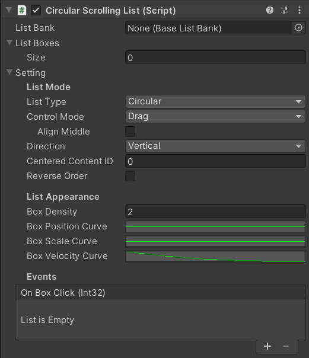
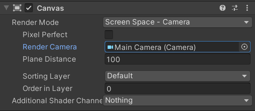
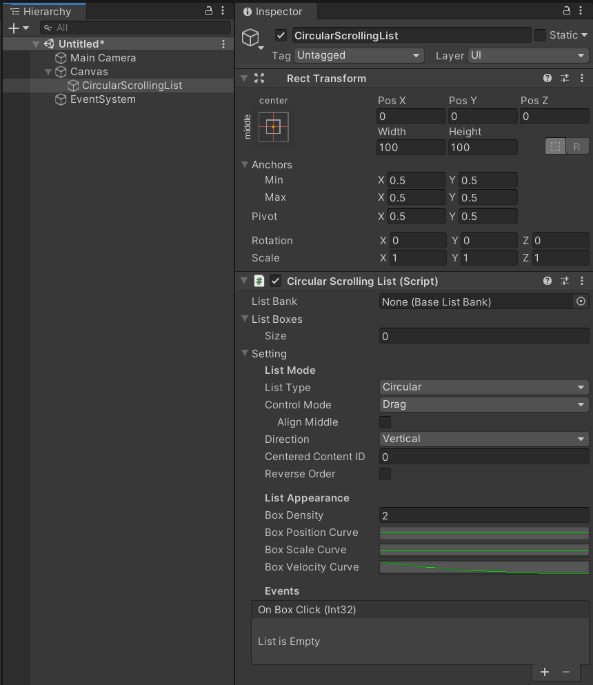
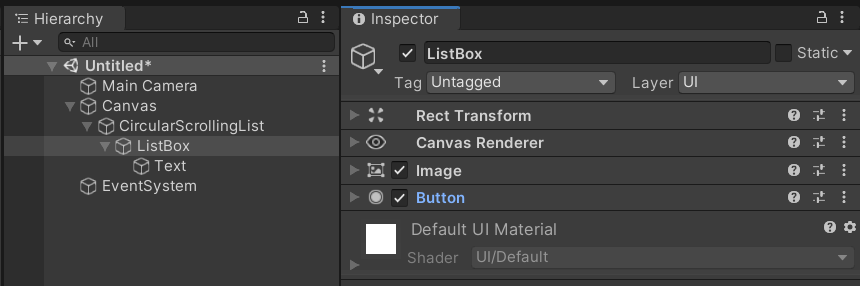
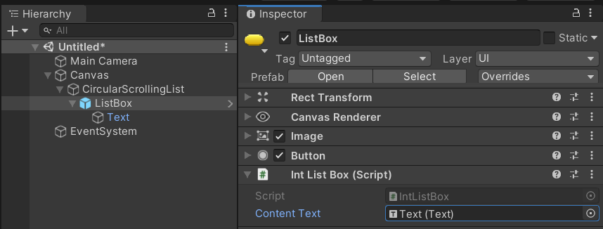
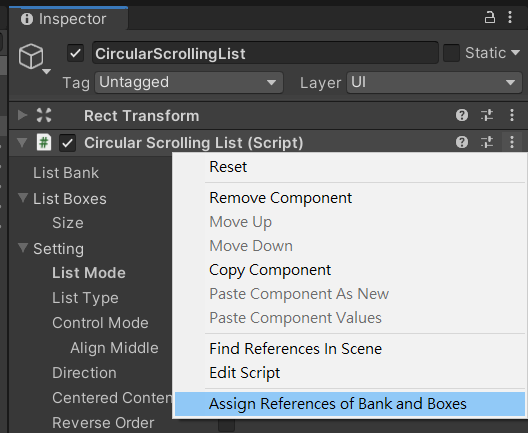
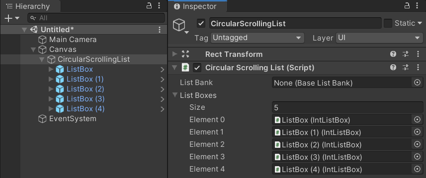
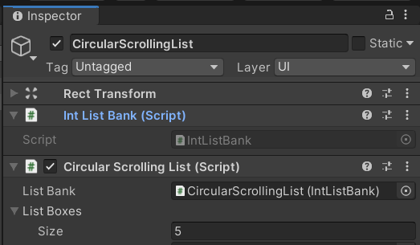
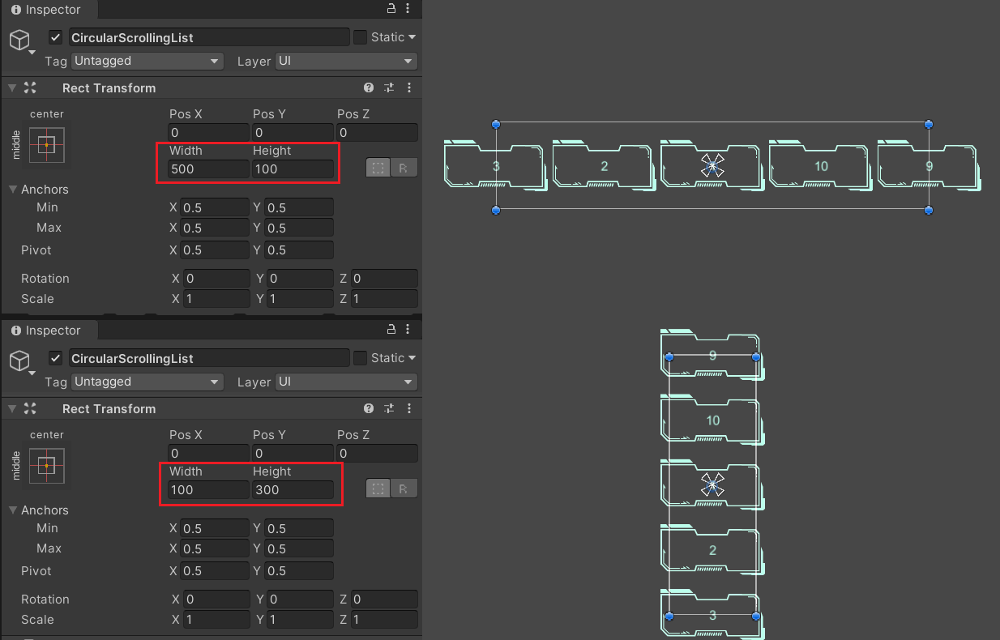

# Circular Scrolling List


## Features

* Use finite list boxes to display infinite list items
* 2 list types: Circular or Linear mode
* 3 Control modes: Drag, Function, or Mouse wheel
* Support both vertical and horizontal scrolling
* Custom layout and movement
* Custom displaying contents
* Support all three render modes of the canvas plane
* Support Unity 5+ (Tested in Unity 5.6.7f1)

[Demo video](https://youtu.be/k63eqwfj-1c)

## Properties



|Property|Description|
|:--------|:--------|
|**List Bank**|The game object that stores the contents for the list to display|
|**List Boxes**|The game objects that used for displaying the content|
|**Setting**|The setting of the list|
|[List Mode]||
|-- **List Type**|The type of the list. Could be **Circular** or **Linear**|
|-- **Control Mode**|The controlling mode. Could be **Drag**, **Function**, or **Mouse Wheel**|
|---- **Align Middle**|Whether to align a box in the middle after sliding or not.<br>Available if the control mode is **Drag**.|
|---- **Reverse Direction**|Whether to reverse the scrolling direction or not.<br>Available if the control mode is **Mouse Wheel**.|
|-- **Direction**|The major scrolling direction. Could be **Vertical** or **Horizontal**|
|-- **Centered**<br>**Content ID**|The initial content ID to be displayed in the centered box|
|-- **Reverse Order**|Whether to reverse the content displaying order or not|
|[List Appearance]||
|-- **Box Density**|The factor for adjusting the distance between boxes.<br>The larger, the closer|
|-- **Box Position Curve**|The curve specifying the passive position of the box|
|-- **Box Scale Curve**|The curve specifying the box scale|
|-- **Box Velocity Curve**|The curve specifying the velocity factor of the box after releasing.<br>Available if the control mode is **Drag**.|
|-- **Box Movement Curve**|The curve specifying the movement factor of the box.<br>Available if the control mode is **Function** or **Mouse Wheel**.|
|[List Event]||
|-- **On Box Click**|The callback to be invoked when a box is clicked.<br>The int parameter is the content ID of the clicked box.|

## How to Use

### Set up the List

1. Add a Canvas plane to the scene. Set the render mode to "Screen Space - Camera" for example, and assign the "Main Camera" to the "Render Camera". \
    
2. Create an empty gameobject as the child of the canvas plane, rename it to "CircularScrollingList" (or another name you like), and attach the script `ListPositionCtrl.cs` to it. \
    
3. Create a Button gameobject as the child of the "CircularList", rename it to "ListBox", change the sprite and the font size if needed. \
    
4. Create a new script `IntListBox.cs` and add the following code. For more information, see [ListBank and ListBox](#listBank-and-listBox) section.

    ```csharp
    using AirFishLab.ScrollingList;
    using UnityEngine;
    using UnityEngine.UI;

    // The box used for displaying the content
    // Must be inherited from the class ListBox
    public class IntListBox : ListBox
    {
        [SerializeField]
        private Text _contentText;

        // This function is invoked by the `CircularScrollingList` for updating the list content.
        // The type of the content will be converted to `object` in the `IntListBank` (Defined later)
        // So it should be converted back to its own type for being used.
        // The original type of the content is `int`, so it could be converted to `string` here.
        protected override void UpdateDisplayContent(object content)
        {
            _contentText.text = (string) content;
        }
    }
    ```

5. Attach the script `IntListBox.cs` to it, assign the gameobject "Text" of the Button to the "Content Text" of the `ListBox.cs`, and then create a prefab of it .\
    
6. Duplicate the gameobject `ListBox` or create gameobjects from the prefab as many times as you want (4 times here, for exmaple)
7. Click the menu of the `CircularScrollingList` and select "Assign References of Bank and Boxes" to automatically add the reference of boxes to it (The list boxes must be the children of `CircularScrollingList`), or maually assign them to the property "List Boxes". \
    
    
8. Create a new script `IntListBank.cs` and add the following code. For more information, see [ListBank and ListBox](#listBank-and-listBox) section.

    ```csharp
    using AirFishLab.ScrollingList;

    // The bank for providing the content for the box to display
    // Must be inherit from the class BaseListBank
    public class IntListBank : BaseListBank
    {
        private readonly int[] _contents = {
            1, 2, 3, 4, 5, 6, 7, 8, 9, 10
        };

        // This function will be invoked by the `CircularScrollingList`
        // when acquiring the content to display
        // The object returned will be converted to the type `object`
        // which will be converted back to its own type in `IntListBox.UpdateDisplayContent()`
        public override object GetListContent(int index)
        {
            return _contents[index].ToString();
        }

        public override int GetListLength()
        {
            return _contents.Length;
        }
    }
    ```

9. Attach the script `IntListBank.cs` to the gameobject "CircularScrollingList"
10. Again click the menu of the `CircularScrollingList` and select "Assign References of Bank and Boxes" to automatically add the reference of `IntListBank` to it (The script must be in the same gameobject of the `CircularScrollingList`), or manually assign it to the property "List Bank". \
    
11. Adjust the height or width of the rect transform of the gameobject "CircularScrollingList". When running, the list boxes will be evenly distributed in the range of height (for **Vertically** scrolling list) or width (fot **Horizontally** scrolling list). \
    
12. Click "Play" to see the result

### Configure the List Mode and Appearance


**Basic Configuration**

* List Type: Circular or Linear
* Control Mode: Drag, Function, or Mouse Wheel
    * Align Middle: Whether to align a box at the center of the list when the list stop moving. Only available in Drag mode.
    * If the Function mode is selected, move the list by invoking `ListPositionCtrl.MoveOneUnitUp()` and `ListPositionCtrl.MoveOneUnitDown()`. For example, you could assign these two functions to buttons to control the list.
* Direction: Vertical or Horizontal
* Centered Content ID: The initial content ID for the centered (or focused) box

**List Appearance**

* Box Density: The gap between boxes. The larger, the closer.
* Box Position Curve: The curve specifying the box position. The x axis is the major position of the box, which is mapped to [0, 1] (from the smallest value to the largest value). The y axis is the factor of the passive position. \
  For example, in the vertical mode, the major position is the y position and the passive position is the x position: \
   \
  It is intuitive in the horizontal mode: \
  
* Box Scale Curve: Similar to the Box Position Curve, but the y axis defines the scale value of the box at that major position.
* Box Movement Curve: The curve specifying movement of the box. The x axis is the movement duration in seconds, which starts from 0. The value of y axis is depended on the mode:
    * In the Drag mode, it is the factor relative to the releasing velocity;
    * In the Function or Mouse Wheel mode, it is the factor relative to the target position.
    

**Curve Presets**

The project provides curve presets. Open the curve editing panel and select the `BoxCurvePresets` to use them. \
 \
 \
The first three curves are position curves, the 4th and 5th one are scale curves, the 6th one is a velocity related curve, and the last one is a position related curve.

After configuration, the set up of the list is done! Click Play button of the scene to check the list.\
You could adjust the position and the size of the list by setting the position and the scale of the gameobject `CircularList`.


## `ListBank` and `ListBox`

[TBD]

### Avoid Boxing/Unboxing Problem

[TBD]

## Get the ID of the Selected Content

There are two ways to get ID of the selected content.

1. Create callback function
2. Get the centered content ID

### Create Callback Function

When a box is clicked, the `ListPositionCtrl` will launch the event `OnBoxClick` (actually launch from the `Button.onClick` event). The callback function (or the listener) for the event must have 1 parameter for receiving the ID of the selected content.

For example, add a function `GetSelectedContentID` as the callback function to the class `MyListBank`.

```csharp
public void GetSelectedContentID(int contentID)
{
    Debug.Log("Selected content ID: " + contentID.ToString() +
        ", Content: " + GetListContent(contentID));
}
```

Then, add it to the "On Box Click (Int 32)" of the script `ListPositionCtrl.cs` in the inspector. (Note that select the function in the "dynamic int" section)\
 \


It will be like: \


### Get the Centered Content ID

The other way is to invoke the function `ListPositionCtrl.GetCenteredContentID()` which will find the list box closest to the center and return the content ID of it.

For example, create a function which will update the content of the centered box to the Text, and use a Button to invoke it.

```csharp
public class MyApplication: MonoBehaviour
{
    public ListPositionCtrl list;
    public Text displayText;

    public void DisplayCenteredContent()
    {
        int contentID = list.GetCenteredContentID();
        string centeredContent = list.listBank.GetListContent(contentID);
        displayText.text = "Centered content: " + centeredContent;
    }
}
```

It will be like: \

